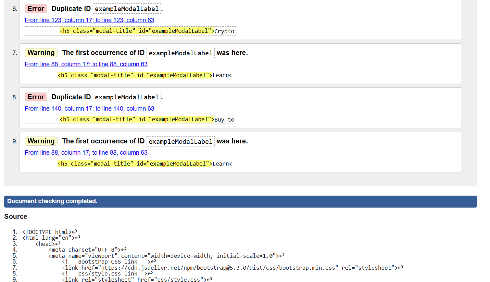
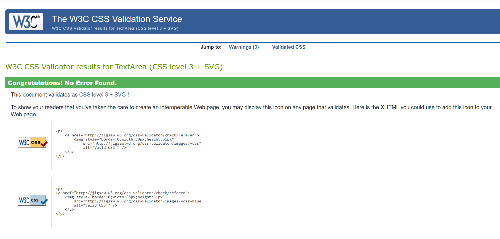

# Errors

## HTML - Errors




## HTML After - No Errors


## CSS - Errors


## CSS After - No Errors




## Java Script - Errors


## Other - Nav bar - font not vertically centered.


## Other - Nav bar - fixed

### Adding an extra margin top of 26px.


## Other - dark mode working on the mobile version of the design but not desktop 


## Other - dark mode working on the mobile version of the design but not desktop - fixed

### Sollution in script.js:

1. Selecting all toggle switches with the class "form-check-input":
   ```javascript
   const toggleSwitches = document.querySelectorAll(".form-check-input");


2. Adding the event listener to each one
    ```javascript
    toggleSwitches.forEach(toggle => {
    toggle.addEventListener("change", toggleDarkMode);

3. When one is clicked, it will toggle the dark mode and synchronize the state of all toggles
    ```javascript
        function toggleDarkMode() {
        document.body.classList.toggle("dark-mode");
        
        // Making sure that both Mobile and Desktop toggles are in sync.
        toggleSwitches.forEach(toggle => {
            toggle.checked = document.body.classList.contains("dark-mode");
        });
    }


