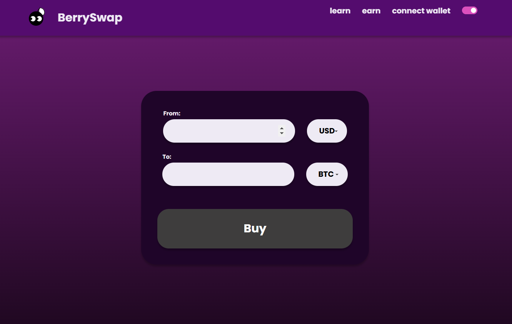
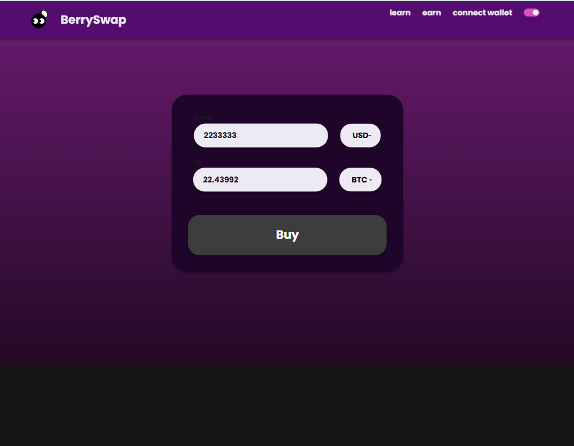
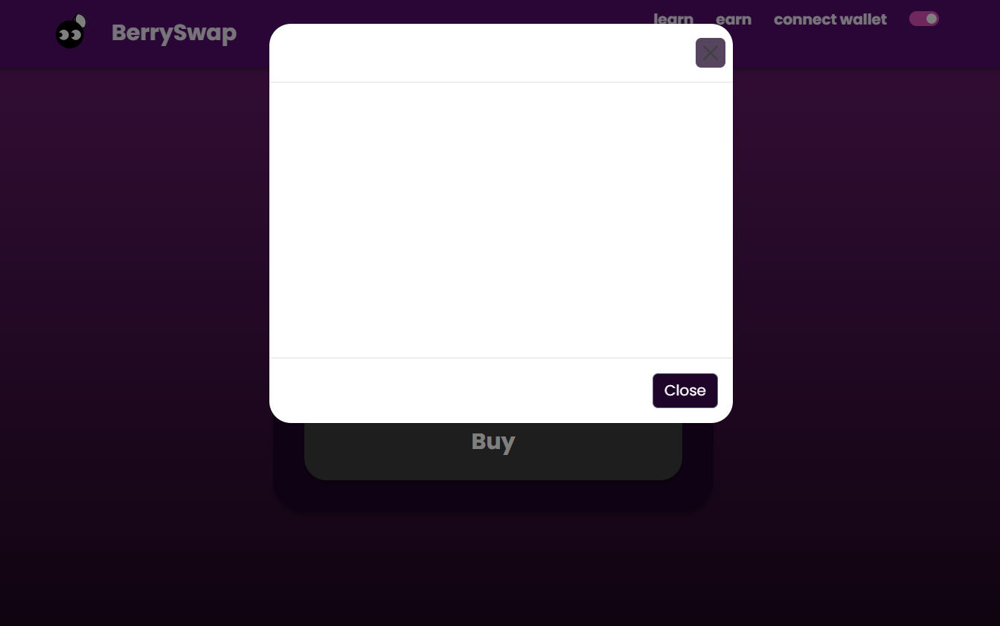
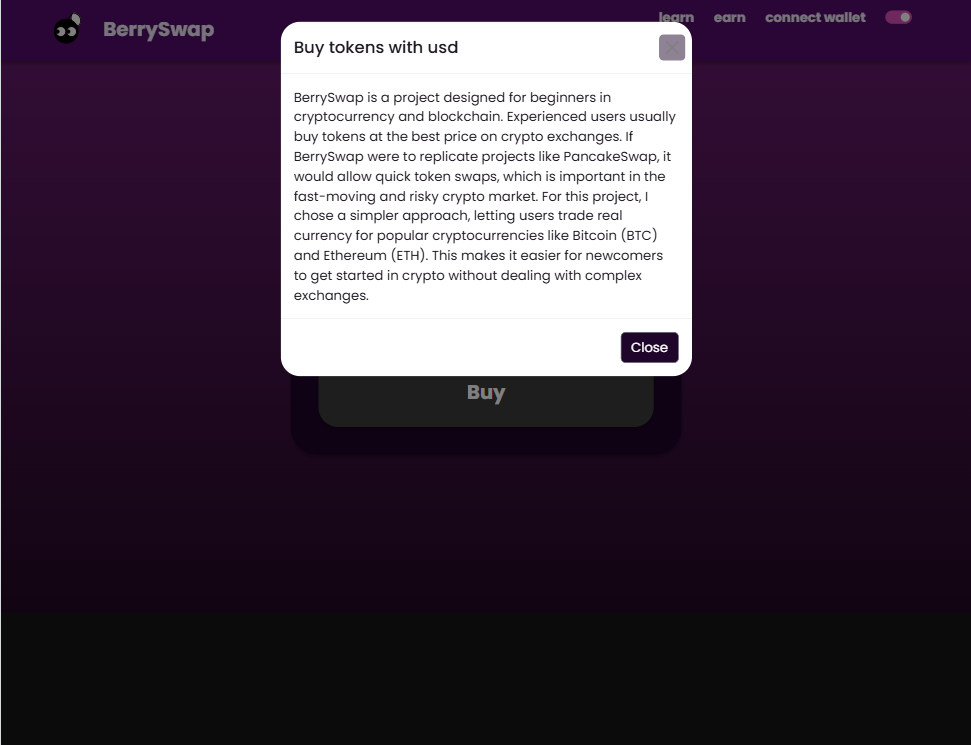

## Manual Testing Table for BerrySwap

This table outlines **manual test cases** following the **GIVEN-WHEN-THEN** approach.

| **#** | **GIVEN (Precondition)** | **WHEN (Action/Event)** | **OBSERVABLE CONSEQUENCES (Expected Outcome)** |
|---|---|---|---|
| 1 | The user is on the homepage | They click on the currency drop down menu | The drop down interface appears, allowing token selection |
| 2 | The user has selected USD as the "From" token and ETH as the "To" token | They enter a valid amount to swap | The estimated ETH amount is displayed |
| 3 | The user connects a wallet successfully | They refresh the page | The wallet remains connected |
| 4 | The user enters an invalid swap amount (e.g., letters or symbols) | They try to proceed with the buy | The keyboard does not allow putting anything else but numbers |
| 5 | The user enables dark mode | They check the toggle | Dark mode is enabled |
| 6 | The user clicks on the Buy Modal while the dark mode is on | They try to read the content | Dark mode is enabled but   |
| 7 | The user enables dark mode | They check the toggle | Dark mode is enabled |

**Screenshot of a failed test 6**

**Fixed - test 6**

**Screenshot of a failed test 7**

**Fixed - test 7**

