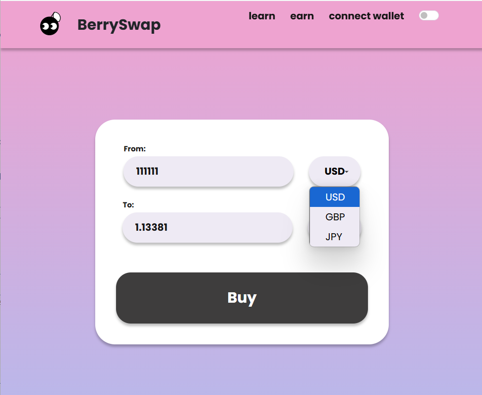
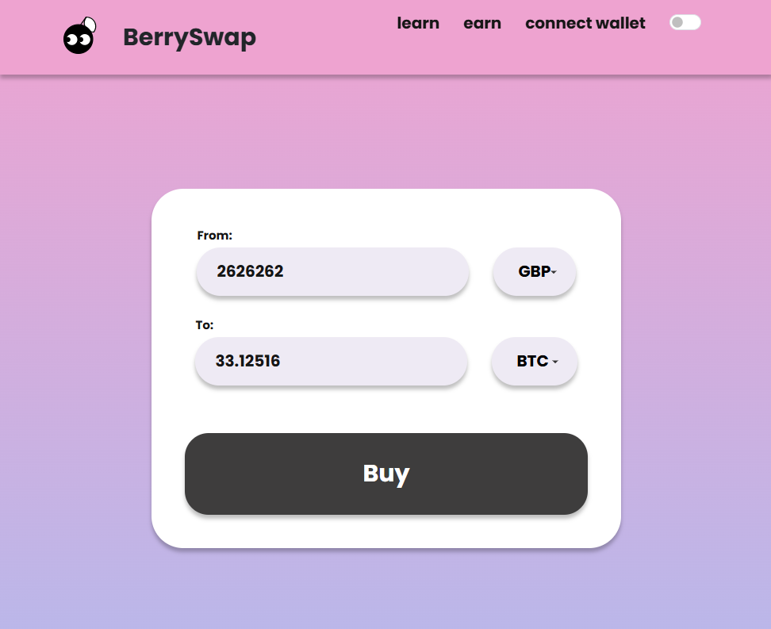
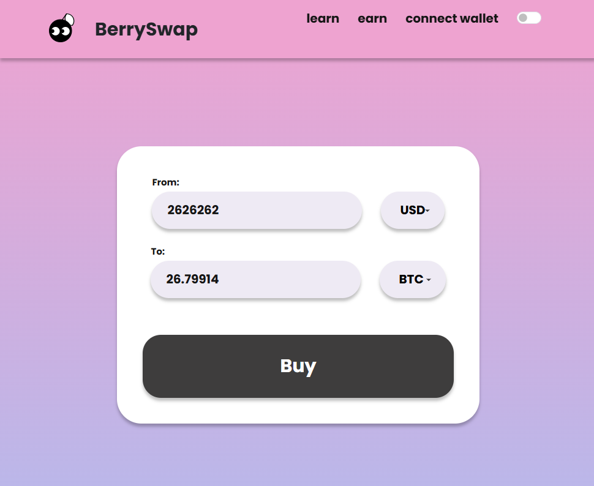
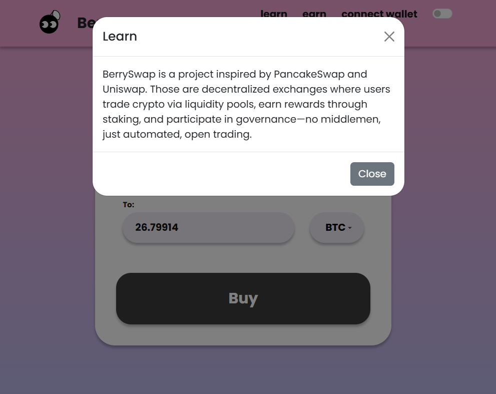
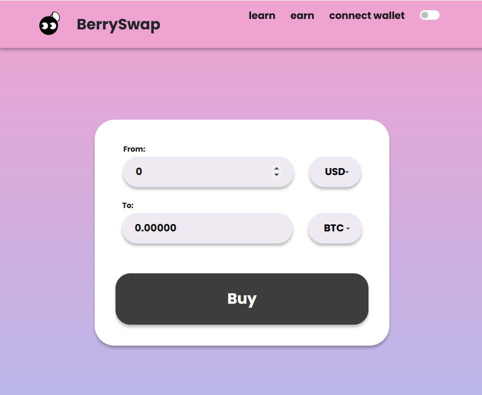

# User Stories

### Core User: Cryptocurrency Beginners & Young Users

### Target Users

Berry Swap caters primarily to cryptocurrency beginners, particularly younger individuals (18-30) who are curious about digital currencies but intimidated by complex trading platforms. These users are digitally native, visually oriented, and appreciate approachable design with playful elements. They seek educational content delivered in simple, jargon-free language and prefer intuitive interfaces that don't require technical knowledge. Often exploring crypto out of curiosity rather than serious investment intentions, they value a safe learning environment that emphasizes education over trading. They typically use mobile devices as their primary means of browsing and expect applications to be responsive, fast-loading, and visually engaging while providing clear, straightforward information without overwhelming complexity.

1. **Simple Currency Conversion**
   - As a cryptocurrency beginner, I want to input a cryptocurrency amount and see its equivalent in fiat currency, so that I can understand the real-world value of crypto without getting overwhelmed.
   - **Acceptance Criteria:**
     - User can enter an amount in the input field
     - The converted amount appears immediately
     - Conversion is accurate based on current exchange rates
     - Interface is simple with no complex options

2. **User-Friendly Currency Selection**
   - As a new crypto explorer, I want to easily switch between popular cryptocurrencies for conversion, so that I can learn about different digital assets without needing technical knowledge.
   - **Acceptance Criteria:**
     - Dropdown menus are clearly labeled and easy to use
     - Limited to popular cryptocurrencies (BTC, ETH) to avoid overwhelming choices
     - Cute icons represent each cryptocurrency
     - Switching currencies updates the conversion immediately

3. **Appealing Visual Design**
   - As a young user new to finance apps, I want a cute and visually appealing interface, so that using the app feels fun rather than intimidating.
   - **Acceptance Criteria:**
     - Playful typography and color scheme
     - Cute "berry" themed design elements
     - Engaging animations for state changes
     - Visually distinct from complex, technical crypto platforms

4. **Visual Comfort Options**
   - As a user who may use the app at different times of day, I want to toggle between light and dark mode, so that I can customize my experience and reduce eye strain.
   - **Acceptance Criteria:**
     - Toggle button has an intuitive icon
     - Visual transition between modes is smooth with animation
     - Dark mode maintains the cute design aesthetic
     - All elements remain visible and functional in both modes

5. **Real-time Exchange Rates**
   - As a curious crypto learner, I want to see current exchange rates, so that I can understand how much cryptocurrencies are worth today.
   - **Acceptance Criteria:**
     - Exchange rates are clearly displayed (e.g., 1 BTC = X USD)
     - Last updated timestamp is visible
     - Simple refresh button to get latest rates

### Educational Elements

6. **Beginner-Friendly Explanations**
   - As someone completely new to cryptocurrency, I want simple explanations of what each currency is, so that I can learn while using the converter.
   - **Acceptance Criteria:**
     - One-sentence descriptions for each cryptocurrency
     - Jargon-free explanations using everyday language
     - Small "info" icons that reveal explanations when clicked

7. **Crypto Basics Section**
   - As a young person interested in learning about crypto, I want access to basic educational content, so that I can understand the fundamentals of cryptocurrency.
   - **Acceptance Criteria:**
     - "Crypto 101" section with simple explanations
     - Cute illustrations that explain complex concepts
     - Content written specifically for beginners
     - No technical jargon without explanation

### Usability & Accessibility

9. **Mobile-First Design**
   - As a young user who primarily uses mobile devices, I want the converter to work perfectly on my smartphone, so that I can check crypto values on the go.
   - **Acceptance Criteria:**
     - Responsive design optimized for mobile screens
     - Large, touch-friendly buttons and inputs
     - No horizontal scrolling required
     - Fast loading even on average mobile connections

10. **Simple Onboarding**
    - As a first-time user, I want a brief introduction to the app's features, so that I can start using it confidently right away.
    - **Acceptance Criteria:**
      - Optional 3-step intro tutorial
      - Clear, concise explanations of core features
      - "Skip" option for returning users
      - Cute character guiding the onboarding process

11. **Accessible Design**
    - As a user with different abilities, I want the converter to be accessible, so that I can use it regardless of my vision or motor skills.
    - **Acceptance Criteria:**
      - High color contrast in both themes
      - Text alternatives for all images
      - Keyboard navigation support
      - Screen reader compatibility

 
 # Key user stories include

## 1. As a user, I want to input a cryptocurrency amount and choose the token from the drop down menu.

## 2. As a user, I want to input a cryptocurrency amount and see its equivalent in fiat currency.

## 3. As a user, I want to easily switch between different cryptocurrencies for conversion.

## 5. As a user, I want to learn about the project.

## 6. As a user, I want to switch to the dark mode.

